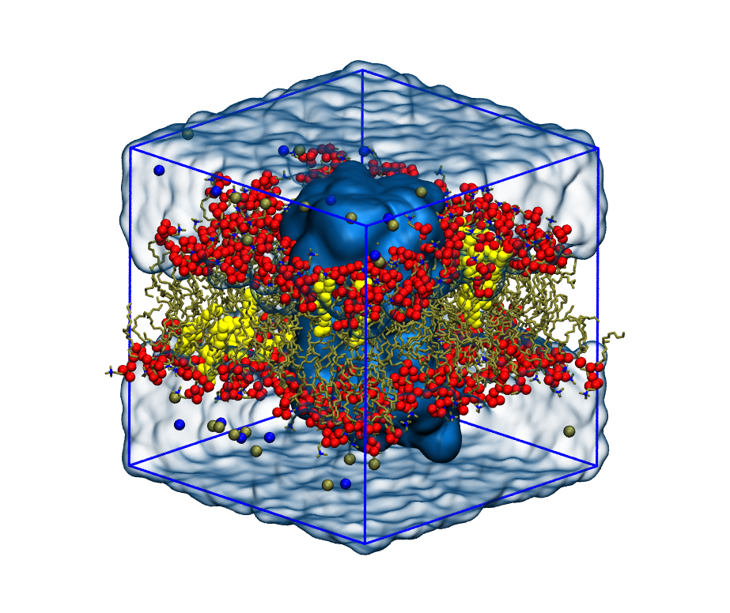

# Molecular Dynamics in a Membrane Environment



This repository is aimed at showing how to build membrane-embedded systems with PACKMOL-Memgen, run simulations with GROMACS and perform a very basic analysis of the membrane.

## Distribution

Under [theory/](theory/) you have the theoretical presentation to the topic. Under [practical/](practical/) you have a [protocol](practical/README.md) with the different steps to be followed. The protocol covers the following how-tos.
- Build, minimize, equilibrate, simulate and analyze a POPC membrane system (under [just_popc/](practical/just_popc)).
- Build and analyze a POPC+CHL membrane system (under [popc+chl/](practical/popc+chl)).
- Build and analyze a POPC+CHL membrane system with an embedded membrane protein (under [membrane_protein/](practical/membrane_protein)).

## Main software

- [PACKMOL-memgen](https://pubs.acs.org/doi/10.1021/acs.jcim.9b00269) to build the membrane-embedded systems.
- [GROMACS](https://manual.gromacs.org/) to prepare, produce and analyze the simulations.
- [FATSLiM](http://fatslim.github.io/) to analyze the membrane in the simulations.

## Setting up

In this repo we assume the [Anaconda](https://www.anaconda.com/) package manager is installed in your computer (you can check that by typing `conda` on your terminal session). If you do, continue from [Creating an environment](./README.md#creating-an-environment). If not, go on with [Installing miniconda](./README.md#installing-miniconda).

### Installing miniconda

A lighter version of [Anaconda](https://www.anaconda.com/) can be installed, and that is [miniconda](https://docs.conda.io/en/latest/miniconda.html). Download and install the latest version of miniconda (for your current OS) using the following commands.

```
wget https://repo.anaconda.com/miniconda/Miniconda3-latest-Linux-x86_64.sh
chmod +x Miniconda3-latest-Linux-x86_64.sh
./Miniconda3-latest-Linux-x86_64.sh
```

Once you have it installed, you probably have to restart your terminal or do `source ~/.bashrc`, and then `conda init bash`.

### Creating an environment

Create a conda environment with the name `md_membrane`. Virtual environments are isolated working environments each with their own independent set of Python packages installed to ensure compatibility within the same project.

```
conda create -n md_membrane python=3.8
conda activate md_membrane
```

Next, install all the packages needed through `conda install`. PACKMOL-Memgen is included in the `ambertools` package suite.

```
conda install -c conda-forge numpy=1.21 pandas matplotlib pytest ambertools
```

### Installing GROMACS and FATSLiM

Check if GROMACS is installed in your system by typing `gmx help` or `which gmx` in your shell. If there's no prompt or the software is not installed, do the following.

```
sudo apt install gromacs
```
> Note: This version of GROMACS does not have GPU support.

Then install FATSLiM. Additionally, test that there are no major errors with the `self-test` functionality.

```
pip install fatslim
```

```
fatslim self-test
```
Once everything is up and running proceed to the [protocol](practical/README.md) to begin the practical part.
