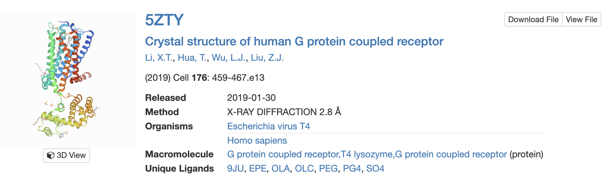

# Protocol

Before you start, clone this repo anywhere you want in your local machine.

```
git clone https://github.com/alquin97/md_membrane_class.git
```

## Simple membrane system

### Just POPC

This part of the protocol will be done under `just_popc/`:

```
cd just_popc
```

#### Membrane creation with PACKMOL-Memgen

First, create a membrane with just POPC using [PACKMOL-Memgen](https://pubs.acs.org/doi/10.1021/acs.jcim.9b00269). With the following command, we're defining a 75x75 A membrane.

```
packmol-memgen --lipids POPC --distxy_fix 75
```

> Note: We are not adding any concentration of ions. Ideally there should be a salt concentration of 0.15M to replicate more accurately the real conditions. However, for the purposes of the tutorial, we're not adding any. Our system is already neutral so it won't necessarily affect the electrostatics.

This process will take some minutes. Once it's done, you can check the resulting membrane with VMD or other visualization software such as [PyMOL](https://www.pymol.org).

```
vmd bilayer_only.pdb
```

#### System topology and transformation to GROMACS

Next, we need to obtain to obtain the Amber force field parameters (version 14SB, ff14SB) for our system. This is done with the processing tool `leap` that will output a .prmtop and .inpcrd files provided of a PDB file.

```
cp ../files/leap.in .
```
```
tleap -f leap.in
```

Recent versions of PACKMOL-Memgen tend to produce errors in GROMACS due to structure clashing. Perform a small minimization of the system with the `sander` module to correct it. Input parameters for `sander` are stated in a `system.sander` file. This process can take some time, you can check the progress in the  `system.sanderout` file.

```
cp ../files/system.sander .
```
```
sander -O -i system.sander -o system.sanderout -p system.prmtop -c system.inpcrd -r system.rst -ref system.inpcrd
```

At the moment, we have the required parameters to run the system in [Amber](https://ambermd.org/AmberMD.php) (equally valid). However, we are simulating in [GROMACS](https://manual.gromacs.org/), so we need to transform them to a .top and .gro files. This is done using `amb2gro_top_gro.py`. Additionally, output the minimization end coordinates with the `-b` option.

```
amb2gro_top_gro.py -p system.prmtop -c system.rst -t system_GMX.top -g system_GMX.gro -b system_out.pdb
```
Finally, copy the 'molecular dynamics parameters' files (.mdp) required for the following parts.

```
cp -r ../files/mdp .
```

#### Energy minimization

We are going to continue with a short minimization (1000 steps), now in GROMACS. Open the file `mdp/min.mdp` in a text editor to check what you are going to do first.

Execute `gmx grompp` to generate a portable binary run file (.tpr), which contains the starting structure of your simulation, the molecular topology and all the simulation parameters.

```
gmx grompp -f mdp/min.mdp -r system_GMX.gro -c system_GMX.gro -p system_GMX.top -o system_min.tpr -maxwarn 1
```
> Note: Read carefully the NOTES and WARNINGS that are printed during grompp. Usually these are a dead giveaway of wrongdoings that doom your runs to failure.

Then, run `gmx mdrun` to perform the actual calculation.

```
gmx mdrun -deffnm system_min -v
```

#### Equilibration

We are going to perform a three-step equilibration of our system on a NPT ensemble. For this, we need to add a positional restraints statement in the `system_GMX.top` for the lipids which will be gradually tuned down to reach equilibrium. This is done by including the following lines within the lipids' [ moleculetype ] section (named 'system1') but before the water's [ moleculetype ] section begins (named WAT, which can have its own set of positional restraints).

```
#ifdef POSRES
#include "posre.itp"
#endif
```

Thus the `system_GMX.top` file should look something like this.

```
[ moleculetype ]
; Name            nrexcl
system1          3

...

#ifdef POSRES
#include "posre.itp"
#endif

[ moleculetype ]
; Name            nrexcl
WAT          3

...
```

The sequential equilibration runs will be executed through the `equi.sh` shell script. Examine the script, it contains four different sections. Figure out what each of them does. Notice also that each equilibration step has its own `equi*.mdp`.

> Hint: you can use `vimdiff file1 file2` to compare two files and spot the differences more easily.

Once you feel ready, execute the `equi.sh` shell script.

```
chmod +x equi.sh
./equi.sh
```

**IMPORTANT: Without GPU support, the whole equilibration will take a long while. We are not gonna wait for all the steps to finish. Kill the process with `CTRL-C` and copy the `just_popc/*` files from the shared folder provided at the beginning of the class. Then continue with the protocol.**

To visualize the time-evolution of the trajectory of the first equilibration step (equi1) use VMD (or any other visualization software).

```
vmd system_min.gro system_equi1.xtc
```

> Note: The .trr file in GROMACS contains the actual trajectory, but it's best to visualize it using the compressed file .xtc

We are also going to assess some of the variables of this equilibration step. We can do that using GROMACS' analysis tools such as `gmx energy`.

```
gmx energy -f system_equi1.edr -o equi1.xvg
```

Pick the variables we want to assess by typing the following numbers.

`12 14 15 20 21 0`

This way we are selecting the **total energy of the system**, **temperature**, **pressure**, **density** and **volume**. The final zero exits the prompt. To visualize the file you can either use `xmgrace` or execute the python script provided in this repo.

```
python ../files/plot_xvg.py equi1.xvg
```

It outputs a .png image in the same location where the .xvg file is located. See how the different variables change along time until stabilized.

#### Production

We are ready to start producing the proper simulation. We are going to do a 100 ns long unbiased MD simulation. Again, we execute `gmx grompp` and then `gmx mdrun`.

```
gmx grompp -f mdp/prod.mdp -r system_equi3.gro -c system_equi3.gro -p system_GMX.top -o system_prod.tpr -n index.ndx -maxwarn 1
```
> Note: See what has changed between the equi3.mdp and prod.mdp files.
```
gmx mdrun -deffnm system_prod -v
```
**IMPORTANT: Two problems arise here:**
- **1) If you use the externally provided output of the equilibration, `gmx grompp` will likely not go through because the shared system_equi3.gro file and your previously generated system_GMX.top file don't match in atom number (inescapable condition). This is true as the two systems were built slightly different (different PACKMOL-Memgen runs).**
- **2) Again, the simulation run takes too long to finish. Proceed with the shared output files.**

Once finished, see what the simulation looks like.

```
vmd system_equi3.gro system_prod.xtc
```

#### Analysis

Next, we will do a short analysis of our membrane. The two typical measurements to examine are the **membrane thickness** and the **area per lipid (APL)**. Use [FATSLiM](http://fatslim.github.io/) to analyze membrane simulations. FATSLiM makes use of lipid 'head groups' to calculate these two values, which must be defined in a index file. Use GROMACS to create a new index file with the lipid head groups properly indexed.

```
gmx make_ndx -f system_equi3.gro -o fatslim.ndx<<EOF
a P31
name 8 headgroups
q
EOF
```
> Question: Which atom is the head group of POPC?

##### Membrane thickness 

To determine the membrane thickness run the following command.

```
fatslim thickness -c system_equi3.gro -t system_prod.xtc -n fatslim.ndx --plot-thickness thickness.xvg
```

The software will give us both the thickness per leaflet and for the whole membrane. Moreover, with the option `--plot-thickness` we can obtain a plot of the thickness over time. You can again use `xmgrace` or the provided python script to plot the .xvg file.

```
python ../files/plot_xvg.py thickness.xvg
```

##### Area per lipid (APL)

The APL is calculated with the following command.

```
fatslim apl -c system_equi3.gro -t system_prod.xtc -n fatslim.ndx --plot-apl apl.xvg
```

And, just like before, the APL per leaflet, for the whole membrane, and a plot over time is generated.

### POPC+CHL

This part of the protocol will be done under `popc+chl/`:

```
cd ../popc+chl
```

In this case, we are going to simulate a membrane with a ratio of 1:3 cholesterol molecules per POPC. Create the membrane with PACKMOL-Memgen with the apropiate input flags.

```
packmol-memgen --lipids POPC:CHL1 --ratio 3:1 --distxy_fix 75
```

Visualize the system (in VMD or PyMOL) and spot the cholesterol molecules. 

> Note: We are gonna skip the system preparation that we did before for the just POPC membrane. If you attempt to run the same preparation protocol for the POPC+CHL membrane, consider that there must be two instances of lipid [ moleculetype ] (one for POPC and one for CHL) in the GROMACS .top file, each with their corresponding positional restraints for the equilibration.

In the same shared folder provided before you will find a 100 ns simulation of a similar POPC+CHL membrane system. Repeat the previous analysis to measure the membrane thickness and APL, and compare those to the POPC-only membrane.

> Hint: Now there are two molecule types contributing to the head groups.

```
gmx make_ndx -f system_equi3.gro -o fatslim.ndx<<EOF
r PC | r CHL & a P31 | a O1
name 9 headgroups
q
EOF
```
> Question: Which atom is the head group of CHL?

## Protein-Membrane system

This part of the protocol will be done under `membrane_protein/`:

```
cd ../membrane_protein
```

### Building the system

This is the real deal. We are going to embed a membrane protein in a lipid bilayer. Our membrane protein is a refined structure of the Cannabinoid Receptor 2 (CB2), a class A GPCR that contains 7 characteristic transmembrane helices. 



Run PACKMOL-Memgen on the provided `protein.pdb` file. Then visualize the system (with VMD or PyMOL).

```
packmol-memgen --pdb protein.pdb --lipids POPC:CHL1 --ratio 10:1 \
    --dist 12 --dist_wat 15 --salt --salt_c Na+
```
> Note: Here, the membrane is built 12 A from the protein to the edges of the box in the X and Y axis and 15 A in the Z axis. We have chosen a concentration of salt of 0.15 M (cations and anions can be specified).

```
vmd bilayer_protein.pdb
```

Again, we are not gonna go over the preparation steps we followed before (because it's gonna take longer than the previous parts). So we are jumping straight to the analysis. 

### Analysis

Copy the 100 ns trajectory of the CB2 receptor embedded in a 10:1 POPC:CHL membrane provided in the shared folder. In this section, we will focus our attention to values concerning the protein rather than the lipids.

#### RMSD

First, measure the RMSD of the C-alpha atoms of the receptor along the trajectory. This can be easliy done with GROMACS.

```
gmx rms -f system_prod.xtc -s system_equi6.gro -o rmsd.xvg
```

GROMACS will prompt us 1) which group to align the system coordinates to and 2) which group to compute the RMSD for. Select the `C-alpha` group in both cases (type `3` and press `Enter`). This way GROMACS will automatically align all the coordinates and calculate the RMSD for the C-alpha atoms of our protein. Plot the .xvg file.

```
python ../files/plot_xvg.py rmsd.xvg
```

#### RMSF

Now, calculate the RMSF of the structure throughout the simulation. This will help us determine how stable our transmembrane alpha-helices are or whether there is some specially labile part of the protein.

```
gmx rmsf -f system_prod.xtc -s system_equi6.gro -o rmsf.xvg
```

Select `C-alpha` as well. Plot the results.

```
python ../files/plot_xvg.py rmsf.xvg
```

#### Secondary Structure analysis

Last, we are going to perform a simple secondary structure analysis to further assess the stability of the transmembrane helices.

```
gmx dssp -f system_prod.xtc -s system_equi6.gro -o dssp.dat
```

GROMACS knows, based on the `index.ndx`, what the atoms of the Protein are. The output `dssp.dat` contains the secondary structure prediction per residue (each character) per frame (each line). Each letter stands for:
- H = α-helix
- B = residue in isolated β-bridge
- E = extended strand, participates in β ladder
- G = 3-helix (310 helix)
- I = 5 helix (π-helix)
- T = hydrogen bonded turn
- S = bend
- ~ = unknown

Plot the output file. You can use this trashy script.

```
python ../files/plot_dssp.py dssp.dat
```
> Note: This will return a `dssp.png` with a heatmap, where each color represents a letter (secondary structure), the sequence in the X-axis and each frame in the Y-axis.
